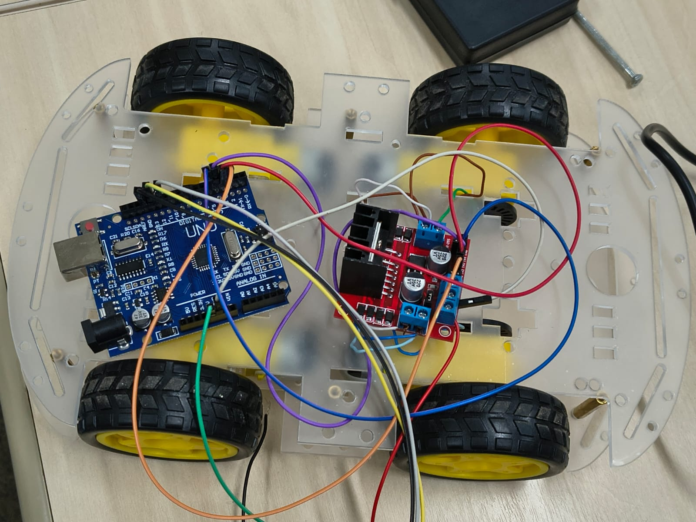
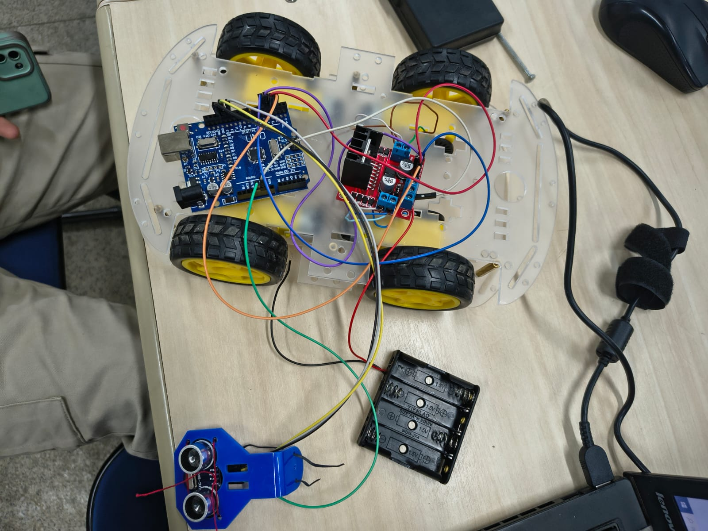
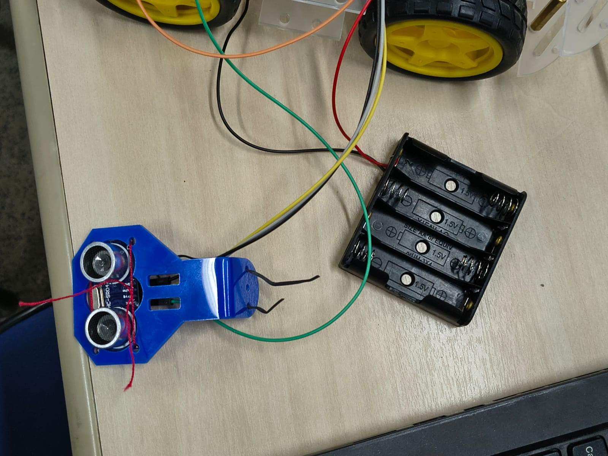
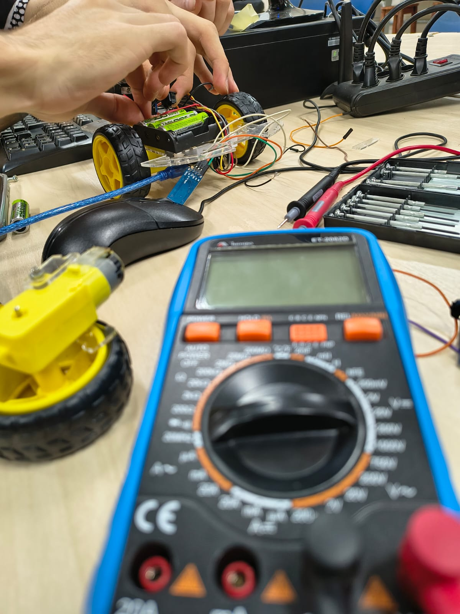
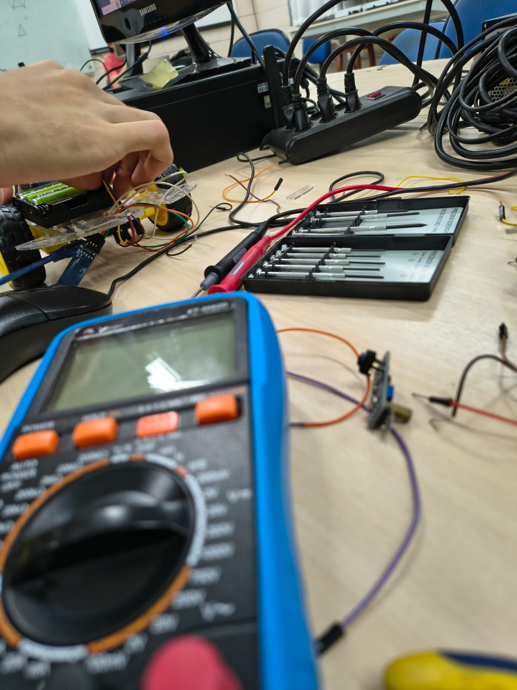
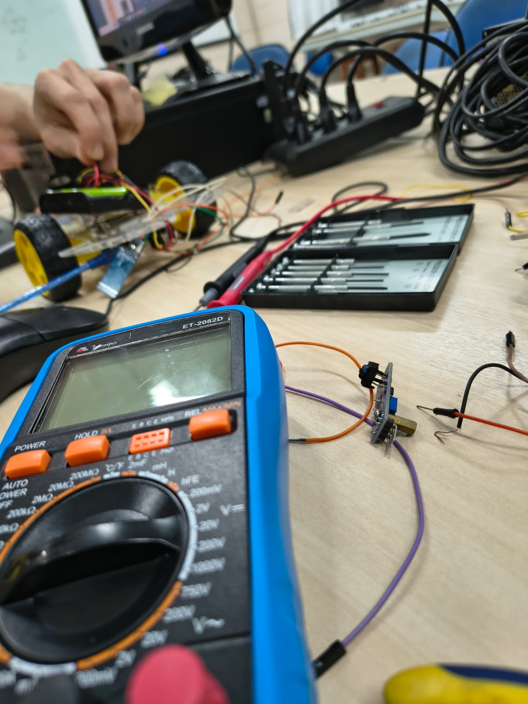
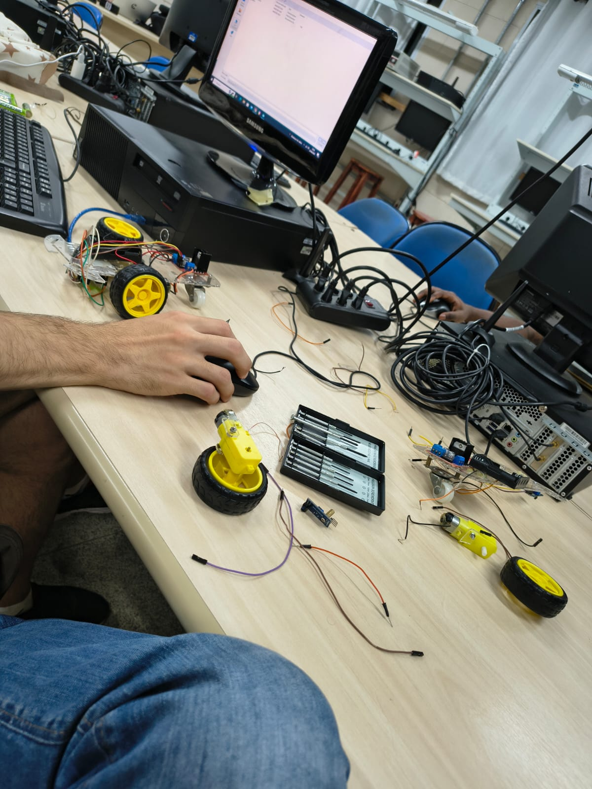
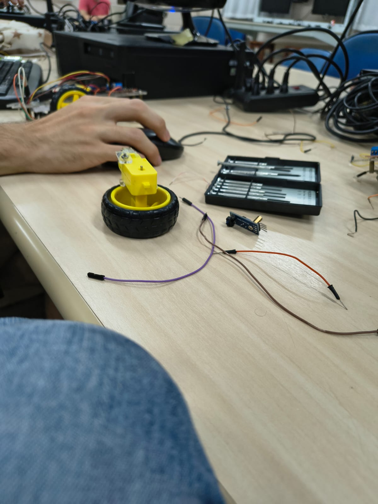
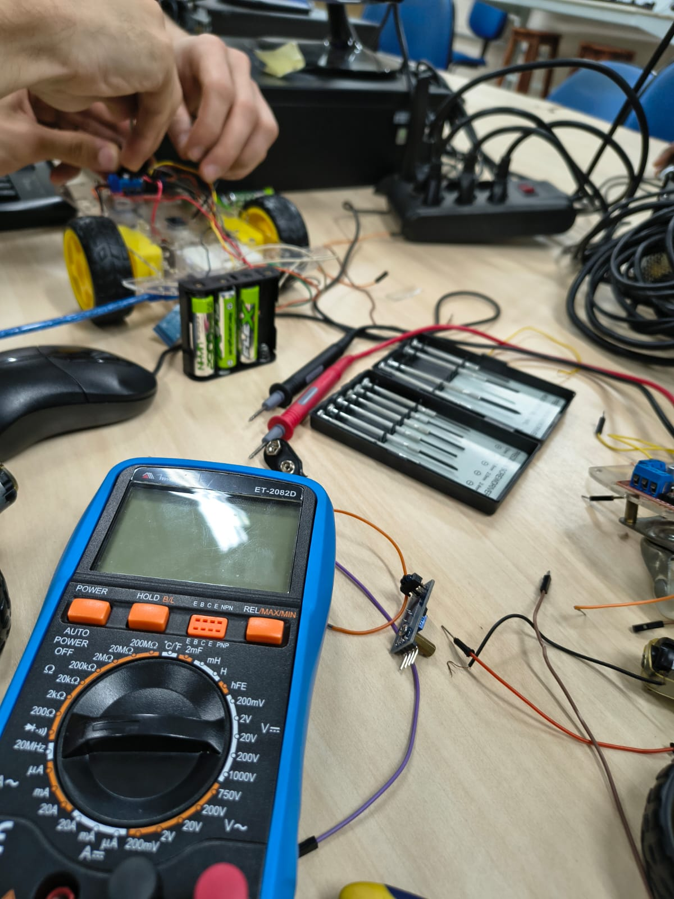

# 🚗 Veículo Autônomo Assistivo - Projeto Integrador

**Instituto Federal de São Paulo (IFSP) - Câmpus Hortolândia**
*Curso Técnico em Eletroeletrônica*

## 👥 Autores
* Gabriel Alonso de Castro
* Leonardo Galvão de Freitas
* Matheus Alves Ramos
* Pedro Augusto da Costa Melo

## 📖 Sobre o Projeto
Este projeto consiste no desenvolvimento de um veículo autônomo assistivo focado em **segurança** e **acessibilidade** no campo de trabalho. O objetivo é auxiliar profissionais no transporte de ferramentas, objetos e na organização do local, mitigando os riscos de acidentes.

O projeto justifica-se pelos dados alarmantes de acidentes elétricos no Brasil (mais de 800 mortes em 2024, segundo a CNN Brasil) e pela necessidade de inclusão de profissionais com mobilidade reduzida ou limitações físicas.

### ⚙️ Funcionalidades Principais
* **Navegação Autônoma:** Desvio de obstáculos e pessoas utilizando sensor ultrassônico.
* **Transporte de Carga:** Estrutura com motores de redução para carregar objetos e ferramentas.
* **Segurança:** Parada automática ao detectar presença humana ou outros obstáculos.
* **Sistema de Limpeza:** Mecanismo de "vassoura" automatizada com servomotor para limpeza de resíduos (fios, fitas) do chão.

## 🛠️ Hardware e Componentes
| Componente | Função no Projeto |
| :--- | :--- |
| **Arduino Uno** | Microcontrolador central (como se fosse o "Cérebro") que processa a lógica dos motores e sensores. |
| **Sensor HC-SR04** | Sensor ultrassônico para leitura de distância e detecção de obstáculos. |
| **Driver Ponte H L298N** | Controle de potência e direção dos motores DC. |
| **Motores DC + Redução** | Motores 3-6V com caixa de redução para garantir **torque** (força) no transporte de peso. |
| **Bateria Li-Ion 7V** | Fonte de alimentação de alta capacidade. |
| **Micro Servo (SG90)** | Atuador para o mecanismo de elevação da vassoura. |
## 📏 Dimensões do Protótipo
Especificações físicas do veículo montado:

| Componente | Medida |
| :--- | :--- |
| **Comprimento do Chassi** | 26 cm |
| **Largura do Chassi** | 15 cm |
| **Comprimento Total** | 31,5 cm |
| **Largura Total (com rodas)** | 15,5 cm |
| **Altura do Chassi** | 5 cm |
| **Altura Total (com roda)** | 6,5 cm |
| **Diâmetro da Roda** | 6,5 cm |
| **Altura da Vassoura** | 8,3 cm |
| **Largura da Vassoura** | 10 cm |
| **Altura do Sensor Ultrassônico** | 12 cm |

## 🔌 Esquemático Eletrônico
O projeto utiliza um circuito baseado no Arduino Uno interligado ao Driver L298N.
*(O esquemático completo e as simulações no Tinkercad podem ser consultados no relatório disponível na pasta `/docs`)*.

## 🚀 Status do Desenvolvimento

| Status | Tarefa |
| :---: | :--- |
| ✅ | **Montagem mecânica do chassi.** |
| ✅ | **Validação dos drivers de potência** (Substituição de Pilhas por Bateria Li-Ion). |
| ✅ | **Lógica de desvio de obstáculos.** |
| ✅ | **Implementação do código final.** (Com a lógica do Servo Motor para a Vassoura). |
| ✅ | **Upload do código fonte e das fotos e vídeos do carrinho.** |

## 📸 Galeria do Projeto

Aqui estão imagens do processo de montagem e do protótipo:

| | | |
| :---: | :---: | :---: |
|  |  |  |
|  |  |  |
|  |  |  |

### 🎥 Vídeos de Teste
Clique nos links abaixo para baixar e visualizar os testes por vídeo:

* 🎬 [Assistir Teste de Funcionamento 1](assets/video-carrinho1.mp4)
* 🎬 [Assistir Teste de Funcionamento 2](assets/video-carrinho2.mp4)
* 🎬 [Assistir Teste de Funcionamento 3](assets/video-carrinho3.mp4)
* 🎬 [Assistir Teste de Funcionamento 4](assets/video-carrinho4.mp4)
* 🎬 [Assistir Teste de Funcionamento 5](assets/video-carrinho5.mp4)
* 🎬 [Assistir Teste de Funcionamento 6](assets/video-carrinho6.mp4)
* 🎬 [Assistir Teste de Funcionamento 7](assets/video-carrinho7.mp4)
* 🎬 [Assistir Teste de Funcionamento 8](assets/video-carrinho8.mp4)
* 🎬 [Assistir Teste de Funcionamento 9](assets/video-carrinho9.mp4)
* 🎬 [Assistir Teste de Funcionamento 10](assets/video-carrinho10.mp4)

## 📄 Documentação
O relatório técnico completo, com: introdução teórica, justificativas e referências bibliográficas, está disponível neste repositório (formato PDF): [Relatório Final-Projeto Integrador Eletroeletrônica.pdf](https://github.com/user-attachments/files/23809845/Relatorio.Final-Projeto.Integrador.Eletroeletronica.pdf)

## 📥 Download do Código
Você pode baixar o código final para abrir diretamente na Arduino IDE:

👉 [**Clique para abrir o arquivo .ino**](https://raw.githubusercontent.com/Gabxzn/Carrinho-Assistido-com-Sensor-Ultrass-nico-Projeto-Integrador-/refs/heads/main/src/Codigo_Final.ino)

---

*2025 - IFSP Hortolândia*
